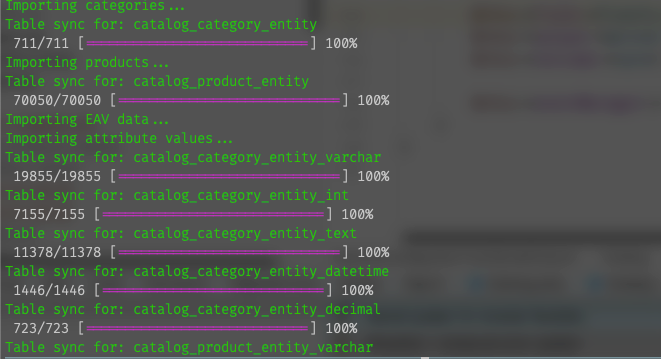

# Magento 2 - Magento 1 Migration Tool

## Documentation In Progress...

### Important

**<span style="color:red ">Module has not been used for 24 months, so you might have few issues in 2.4 ;-) </span>**
**<span style="color:red ">This tool was never used with MSI, it was used from M2.1 up to M2.3 without MSI</span>**
**<span style="color:red ">Feel Free to Create a PR that supports MSI</span>**

### Installation

Installation is via `composer`
```
composer require qoliber/m2-m1migration
```

After installing the packages just run:
```
php bin/magento setup:upgrade
```

### Requirements

* `PHP 7.4` and higher
* `Magento 2.1` and higher (you might adjust the code to work with `PHP 7.2`)
* module `Magento_Swatches` has to be **enabled**

### Used on

* `Magento 2.1.x` OpenSource and Commerce (2018-2019)
* `Magento 2.2.x` OpenSource and Commerce (2019-2020)
* `Magento 2.3.x` OpenSource

### How this works?

There are 2 ways the import works. I recommend checking both classes and the code before you start working on this

- Sync method, via `SyncAbstract` class that works on EAV table structures
- Data mapping method, via `TableImportAbstract` class that work on other tables.

The idea behind this module is simply to determine & capture the differneces in between Magento 1 and Magento 2 databases and simply MAP data from 1 database to another without any weird logic behind it.
Module only imports data so:

- any attribute source models have to be recreated in the M2 code base

Module adds a lot of CLI commands to support:

- full data migration
- partial data migration for specified entites (orders, cms blocks, email templates and so on)

#### Supported Data Migration

* Product Attributes (with image swatches sync)
* CMS Pages
* CMS Blocks
* Store Configuration
* Sales Data
* Customer Data with password
* Newsletter subscribers
* URL regeneration

## Usage

1. You need to have Magento 1 database access 
2. Log to Admin Panel and configure M1 database access under: Stores -> Configuration -> M1 Import Tools
3. Save Configuration
4. Go to CLI and run: `php bin/magento qoliber:import:full`

The script will:

- recreate stores
- recreate and check for all store attributes assigned to products 
- import customers
- import sales data (orders, invoices, credit memos)
- import catalog
- impory and sync stocks
- cms blocks and pages import
- gallery import with images file import (M1 images have to be in the same path as M2 images)

During import you will be shown the status of migration for specified entities:


## Product import

Module only imports:
- simple products
- configurable products

For bundle products / downloadable products you have to create a proper table sync operations.
